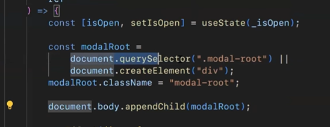

# Day 42 + 43: RTK, RTK Query, Login, Register, React hook form

1. RTK

````javascript
import { createAsyncThunk } from "@reduxjs/toolkit";
import axios from "axios"; // Giả sử bạn dùng axios

// createAsyncThunk nhận 2 tham số:
// 1. Tên action: "tên_slice/tên_hành_động"
// 2. Hàm async thực thi việc gọi API
export const getProductList = createAsyncThunk(
    "product/getList",
    async () => {
        const response = await axios.get("https://api.example.com/products");
        return response.data; // Dữ liệu trả về sẽ vào action.payload
    }
); ```
````

### services/products/productService.js

-   Là nơi gọi bất đồng bộ api và trả về dữ liệu. Hãy coi phần này cuối cùng là một action bao gồm: action.type và action.payload

```javascript
import { createSlice } from "@reduxjs/toolkit"
import { getProductList } from "@/services/products/productService"

const initialState = {
    list: [],
    isLoading: false,
    error: null,
}

export const productSlice = createSlice({
    name: "product",
    initialState,
    // Dành cho các action đồng bộ (synchronous)
    reducers: {
        // ví dụ: setSort: (state, action) => { ... }
        // Xu ly cac action khi ko phai xu ly bat dong bo
    },
    // Dành cho các action bất đồng bộ (asynchronous) từ createAsyncThunk
    extraReducers: (builder) => {
        builder
            .addCase(getProductList.pending, (state) => {
                state.isLoading = true
                state.error = null
            })
            .addCase(getProductList.fulfilled, (state, action) => {
                state.isLoading = false
                state.list = action.payload // Gán dữ liệu từ API vào state
            })
            .addCase(getProductList.rejected, (state, action) => {
                state.isLoading = false
                state.error = action.error.message
            })
    },
})

// Export reducer để thêm vào store
export default productSlice.reducer
```

### features/products/productSlice.js

-   Tạo ra một Slice
-   extraReducer sẽ xử lý các action bất đồng bộ. Ở đây nó sẽ bắt trạng thái dữ liệu đang là gì: pending, fulfilled, rejected
-   reducer sẽ xử lý các action mà không cần xử lý bất đồng hộ

2. RTK Query

```javascript
import { createApi, fetchBaseQuery } from "@reduxjs/toolkit/query/react"

export const addressApi = createApi({
    reducerPath: "addressApi",
    baseQuery: fetchBaseQuery({ baseUrl: import.meta.env.VITE_BASE_API }),
    endpoints: (build) => ({
        getProvinces: build.query({
            query: () => `/address/provinces`,
        }),
    }),
})

export const { useGetProvincesQuery } = addressApi
```

### features/provinces

-   Tạo ra một addressApi và tất cả mọi thứ sẽ được xử lý trong nó
-   Dữ liệu sẽ được trả ra ở useGetProvincesQuery

## Cấu hình store

1. Đối với RTK

-   Chỉ cần thêm reducer của nó vào RootReducer là xong

2. Đối với RTK QUERY

-   Cần thêm middleware của nó vào cái tổng rootReducer

```javascript
import { combineReducers, configureStore } from "@reduxjs/toolkit"
import { persistStore, persistReducer } from "redux-persist"
import storage from "redux-persist/lib/storage" // defaults to localStorage for web

import { productSlice } from "@/features/products/productsSlice"
import { provincesApi } from "@/features/provinces"
import { setupListeners } from "@reduxjs/toolkit/query"
import { authSlice } from "@/features/auth"

const rootReducer = combineReducers({
    [productSlice.reducerPath]: productSlice.reducer,
    [provincesApi.reducerPath]: provincesApi.reducer,
    [authSlice.reducerPath]: authSlice.reducer,
})

const persistConfig = {
    key: "root",
    storage,
}

const persistedReducer = persistReducer(persistConfig, rootReducer)

const store = configureStore({
    reducer: persistedReducer,
    middleware: (getDefaultMiddlewares) => [
        ...getDefaultMiddlewares({
            serializableCheck: false,
        }),
        provincesApi.middleware,
    ],
})

const persistor = persistStore(store)

setupListeners(store.dispatch)

export { store, persistor }
```

=> Trên đây là cấu trúc file store cho cả RTK và RTK query

=> Ở đây sử dụng cả redux-persist

-   Giúp lưu trữ các state của Redux store vào một nơi (localStorage với web)
-   Giúp lưu trữ state lại khi f5 lại trang
-   persistor sẽ được sử dụng ở main

## Các loại dữ liệu NÊN lưu (Good to Persist) 👍

Giỏ hàng (Shopping Cart)

Đây là trường hợp kinh điển. Người dùng thêm 5 món đồ vào giỏ, lỡ tay F5, và thấy giỏ hàng trống rỗng. Đây là một trải nghiệm rất tệ. redux-persist giúp giữ lại giỏ hàng của họ.

Cài đặt người dùng (User Preferences)

Giao diện: Chế độ Sáng/Tối (theme: 'dark').

Ngôn ngữ: Lựa chọn ngôn ngữ của người dùng (language: 'vi').

Bộ lọc: Các bộ lọc mà người dùng đã áp dụng trên một trang danh sách sản phẩm (ví dụ: "sắp xếp theo giá", "chỉ hiển thị hàng chính hãng").

Trạng thái Giao diện (UI State)

Ví dụ: Trạng thái đóng/mở của thanh sidebar (isSidebarCollapsed: true). Nếu người dùng thích làm việc với sidebar đã thu gọn, nó nên giữ nguyên như vậy khi họ quay lại.

Thông tin người dùng cơ bản (Non-sensitive User Info)

Tên người dùng, avatar, email (những thông tin cơ bản dùng để hiển thị trên header).

LƯU Ý: Tuyệt đối không lưu token theo cách này.

## Day 44. Refresh Token + Validate Form with Yup

1. Refresh Token

### Hiểu về Authentication và Authorization

-   Khi truy cập tài nguyên được bảo vệ(VD: Thông tin người dùng đang đăng nhập)

-   Authentication: (Xác thực người dùng. Xem có đúng là bạn hay không)
    -   Gửi đi thông tin đăng nhập (Credentials)
    -   => Nhận được token và lưu lại (localStorage)
-   Truy cập tài nguyên được bảo vệ: (Kiểm tra quyền truy cập của mình vào tài nguyên đó. Mình có được quyền vào đó k)
    -   JWT hợp lệ: 201 + data
    -   JWT không hợp lệ: 401

### Hiểu về JWT: JSON WEB TOKEN

```
JWT là viết tắt của JSON Web Token.

Đây là một tiêu chuẩn mở (RFC 7519), được hiểu là một "thẻ bài" hoặc một "giấy thông hành" kỹ thuật số.

Nó được dùng để truyền tải thông tin một cách an toàn giữa các bên (ví dụ: giữa Front-end của bạn và Back-end) dưới dạng một đối tượng JSON. Thông tin này được tin cậy vì nó đã được "ký tên" bằng chữ ký điện tử.

Hiểu nôm na JWT là gì?
Hãy tưởng tượng JWT giống như một thẻ ID (Căn cước) có chữ ký và được ép plastic.

Khi bạn đăng nhập (Authentication) vào một hệ thống:

Bạn đưa email và password (giống như đưa CMND).

Server kiểm tra, thấy bạn hợp lệ, và cấp cho bạn một cái JWT (giống như phát cho bạn một cái "thẻ khách" đã được ký tên và đóng dấu).

Sau đó, mỗi khi bạn muốn truy cập một khu vực được bảo vệ (ví dụ: xem giỏ hàng, trang cá nhân):

Bạn chỉ cần chìa cái "thẻ khách" (JWT) này ra.

Bảo vệ (Server) không cần kiểm tra lại CMND của bạn nữa. Họ chỉ cần:

Nhìn xem con dấu, chữ ký (Signature) trên thẻ có phải là thật không?

Thẻ này có cho phép bạn vào khu vực này không (Payload)?

Nếu thẻ hợp lệ, họ cho bạn qua.

Đây chính là quá trình Authorization (Ủy quyền) mà bạn đã hỏi trước đó.
```

## Refresh Token

-   Khi access_token hết hạn, thì rất nhiều api sẽ bị lỗi.
    Tuy nhiên chỉ một cái đầu tiền refresh token. Và các api khác sẽ đợi cho tới cái đầu tiên refresh token xong và trả về token mới và sử dụng nó
    => Đoạn code hoàn chỉnh để xử lý refresh token

```javascript
// ============================================
// PHẦN 3: XỬ LÝ LÀM MỚI TOKEN TỰ ĐỘNG
// ============================================

// Biến theo dõi xem có đang làm mới token không
// Tránh trường hợp nhiều request cùng lúc đều cố gắng làm mới token
let isRefreshing = false

// Hàng đợi chứa các request bị lỗi 401 (hết hạn token)
// Giống như hàng người chờ, khi có token mới sẽ cho tất cả vào cùng lúc
let failedQueue = []

// Hàm xử lý tất cả request đang chờ trong hàng đợi
const processQueue = (error) => {
    // Duyệt qua từng request đang chờ
    failedQueue.forEach((prom) => {
        if (error) {
            // Nếu có lỗi (làm mới token thất bại), thông báo lỗi cho tất cả
            prom.reject(error)
        } else {
            // Nếu thành công, cho phép tất cả request thử lại
            prom.resolve()
        }
    })

    // Xóa sạch hàng đợi sau khi xử lý xong
    failedQueue = []
}

// Hàm thực hiện việc làm mới token
const refreshToken = async () => {
    try {
        // Gọi API làm mới token bằng refreshToken hiện có
        const result = await axios.post(`${baseURL}/auth/refresh-token`, {
            refresh_token: localStorage.getItem("refreshToken"),
        })

        // Lưu cặp token mới vào localStorage
        localStorage.setItem("accessToken", result.data.data.access_token)
        localStorage.setItem("refreshToken", result.data.data.refresh_token)

        // Thông báo thành công cho tất cả request đang chờ
        processQueue(null)
    } catch (error) {
        // Nếu làm mới token thất bại, thông báo lỗi cho tất cả
        processQueue(error)
        throw error // Ném lỗi để hàm gọi biết việc làm mới thất bại
    }
}

// Hàm điều phối việc lấy token mới
// Đảm bảo chỉ có 1 request làm mới token tại một thời điểm
const getNewToken = async () => {
    // Nếu chưa có ai đang làm mới token
    if (!isRefreshing) {
        isRefreshing = true // Đánh dấu là đang làm mới
        await refreshToken() // Thực hiện làm mới token
        isRefreshing = false // Đánh dấu hoàn thành
        return
    }

    // Nếu đã có request khác đang làm mới token
    // Thì request này sẽ xếp hàng chờ đợi
    return new Promise((resolve, reject) => {
        // Thêm vào hàng đợi, sẽ được xử lý khi token mới sẵn sàng
        failedQueue.push({ resolve, reject })
    })
}

// ============================================
// PHẦN 4: XỬ LÝ RESPONSE VÀ LÀM MỚI TOKEN
// ============================================

// Interceptor (bộ chặn) response: chạy SAU KHI nhận được phản hồi từ server
httpClient.interceptors.response.use(
    // Nếu response thành công (status 200-299), trả về nguyên bản
    (response) => response,

    // Nếu có lỗi, xử lý ở đây
    async (error) => {
        // Lưu lại thông tin request gốc để có thể thử lại sau
        const originalRequest = error.config

        // Kiểm tra xem có nên làm mới token không:
        // - Lỗi 401 (Unauthorized - token hết hạn)
        // - Request này chưa từng được thử lại (_retry chưa set)
        const shouldRenewToken =
            error.response.status === 401 && !originalRequest._retry

        if (shouldRenewToken) {
            // Đánh dấu request này đã được thử lại, tránh lặp vô hạn
            originalRequest._retry = true

            try {
                // Lấy token mới
                await getNewToken()

                // Thử lại request ban đầu với token mới
                // httpClient sẽ tự động gắn token mới vào (nhờ interceptor request)
                return httpClient(originalRequest)
            } catch (error) {
                // Nếu làm mới token thất bại, trả về lỗi
                // (Thường thì sẽ redirect về trang login)
                return Promise.reject(error)
            }
        }

        // Nếu không phải lỗi 401 hoặc đã thử lại rồi, trả về lỗi bình thường
        return Promise.reject(error)
    }
)
```

## Day 45: Error Boundaries. Code Spliting. useReducer, Infinity Load

1. Error Boundaries

-   Sử dụng để bắt lỗi các component con bên trong. Giúp hiển thị ra một UI tùy chỉnh mà ko để trường hợp màn hình trắng hiện lên

Link: https://legacy.reactjs.org/docs/error-boundaries.html

-   => Sử dụng class compnent cho Error Boudaries
-   => Bọc nó bên ngoài cùng của App trong main để bắt lỗi tất cả

2. Code Spliting : Chia nhỏ code. Lúc nào truy cập thì mưới tải. Tải 1 lần nó sẽ đc cache lại và lần sau truy cập sẽ ko bị tải lại

### Khi nào nên sử dụng:

-   Khi một component quá lớn > 100kb
-   Khi một component được truy cập lần đầu một cách trực tiếp (VD: Home, sản phẩm, chi tiết sp, ...)

#### Note: Thêm Suspense để xử lý nêú trường hợp nó tải lâu quá thì thêm loading.

Ví dụ: products sử dụng code spliting. Nấu bấm vào products => Cần tải file js cho page đó. Trong thời gian tải nên thêm loading

```javascript
<Suspense fallback={<div>Loading...</div>}>
    <App />
</Suspense>
```

## React portal

#### Lưu ý với transform: Thẻ bên ngoài dùng transform, thẻ bên trong nó dùng position: fixed => Nó sẽ phá hỏng position fixed của thẻ bên trong nó

```javascript
<body>
    <div id="root"></div>

    <div id="portal-root"></div>
</body>
```

-   Sử dụng một portal-root để bọc tất cả các phần tử được đưa ra ngoài
    
-   Cách để chỉ tạo một lần mỗi khi mở, nếu ko nó cứ liên tục thêm khi mở modal

## Infinity load
